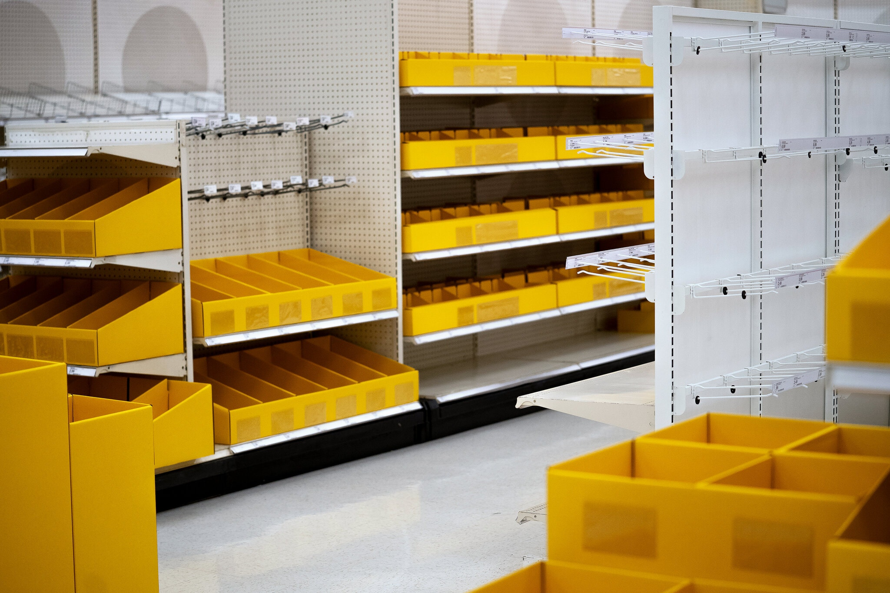

**<h1 style="color:#A2FF33">supply chain management on the blockchain</h1>**
(Final Project: Consensys Blockchain Developer Bootcamp)<br>
<em><h6>Nitashia Johnson for [The New York Times](https://www.nytimes.com/2021/06/01/business/coronavirus-global-shortages.html). </h6></em> 


**<h3 style="color:#FFC733">To run the project locally:</h3>** 

**<h4 style="color:#FFC733">Requirements:</h4>** 
- Node.js 
- Truffle 
- Ganache
- npm
- ```git checkout main```

**<h4 style="color:#FFC733">Solidity backend:</h4>** 
- run ```npm install``` in the ```client``` folder to install Truffle and smart contract dependencies
- run ```ganache-cli``` to start a local testnet on port 8545 
- truffle migrate --network development
- truffle console --network development
- run tests in Truffle console with ```test```
- development network chain id is 5777

**<h4 style="color:#FFC733">React frontend:</h4>** 
- cd client
- run ```npm run start```
- access the app locally on http://localhost:3000
- your Metamask localhost network should be on port 8545 and chain id 5777

**<h4 style="color:#FFC733">Launching the application:</h4>** 
- cd client
- run ```npm run start```
---

**<h3 style="color:#FFC733">Screencast link</h3>** 
t.b.d

---

**<h3 style="color:#FFC733">Public Ethereum account for certification</h3>** 
0x6c6F915B21d43107d83c47541e5D29e872d82Da6

---

**<h3 style="color:#FFC733">Overview</h3>** 
It comes as no shock that it’s common practice in some businesses and industries to overstate the scarcity of a certain item in order to spike demand and perceived value. This project provides a safe and secure way for buyers of commodities (fuel, medical and household goods, etc.) to make purchases with transparency about the seller’s available inventory at a previously locked in price and locked in quantities (DECLARED INVENTORY). This is especially useful for buyers during periods of crisis. The application takes  advantage of the blockchain's secure, verified and distributed ledger to manage inventory, verifying the supply chain of goods and limiting anyone’s ability to intentionally manipulate pricing by faking scarcity.       

**<h3 style="color:#FFC733">Seller</h3>** 
The supplier must record both the price and quantity of their inventory six months before it is available for sale. At that point, both price and inventory are locked in regardless of future market conditions. 


**<h3 style="color:#FFC733">Buyer</h3>** 
Consumers elect to purchase from suppliers who participate in this system of transparency and accountability. As consumers purchase a good, the ledger is updated via Smart Contract and the updated stock values are revealed to all buyers. Inventory pricing and quantities are constantly verified over time making it very difficult to artificially manipulate their values. This secure marketplace for goods, especially in countries with uncertain market conditions, will attract a critical mass of buyers who prefer to make verified purchases thus putting pressure on suppliers to participate in the marketplace.   

**<h3 style="color:#FFC733">Safeguards</h3>** 
If a vendor makes fake claims, they will get punished by being expelled from participation in the marketplace. Their profits will be slashed.   

---
**<h3 style="color:#FFC733">MVP</h3>** 
MVP does not deal with separating seller and buyer functionality. Current application allows the user to add market items and buy market items in the same view.   

**<h3 style="color:#FFC733">MVP Workflow</h3>** 
- a seller will be able to add a market item, its price and quantity and see it populate the inventory list
- a buyer will see the DECLARED INVENTORY and price as well as the current stock availability 
- once the buyer elects how much product they want to buy, they will see the inventory update in real time
---

**<h3 style="color:#FFC733">Directory Structure</h3>** 
- ``client``: project's React frontend
- ``contracts``: solidity contracts deployed on the Rinkeby testnet
- ``migrations``: migration files for deploying the contracts in the contracts directory 
- ``test``: tests for smart contracts
<p>&nbsp;</p> 


